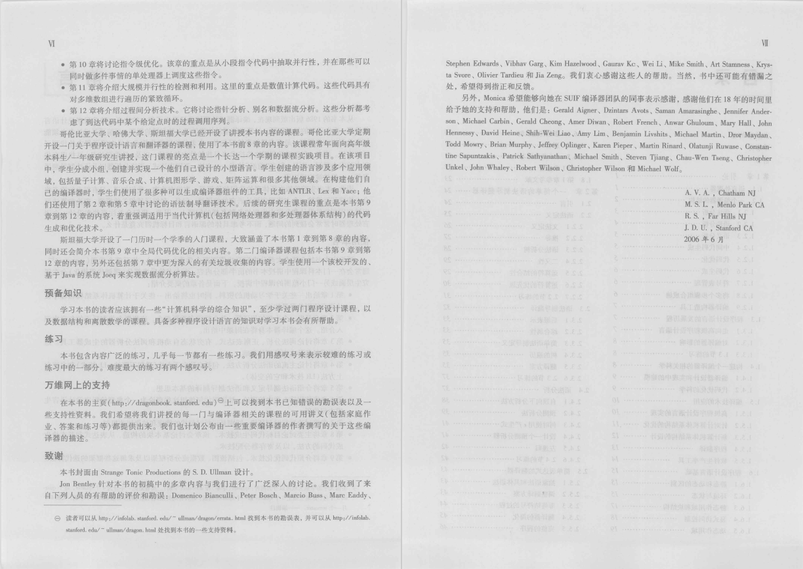
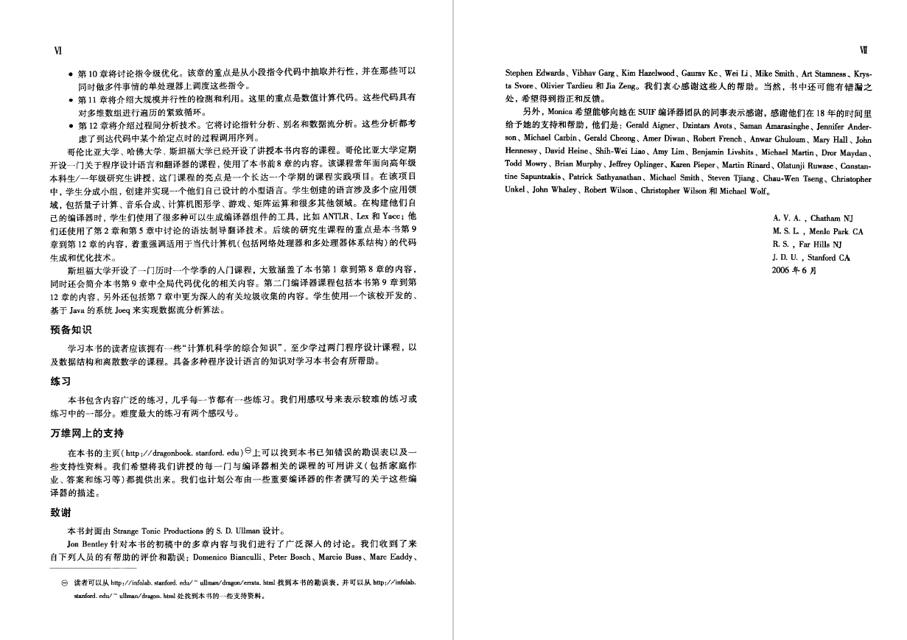

# Pdf Image Binarization

> Special thanks to [@chriswolfvision](https://github.com/chriswolfvision) for his [binarization project](https://github.com/chriswolfvision/local_adaptive_binarization).

Binarize all pages in a scanned PDF file. 

Generally, binarizing an image is to turn the image into black and white. It's useful for images from scanner, which not only make the scanned image more readable but also reduce its size. With the tool, you can convert your PDF files from scanner into black and white in batch.

I downloaded a book from digital resources offered by the school library. But I found the pdf file is from a scanner and characters in it is blurred with the background, making it hard to read. So I write this small script to help me binarize them in batch. Here is binarization result of the book.

**Before**



**After**




## Preparation

### Clone Project

```
git clone http://github.com/yusanshi/pdf_image_binarization --recursive
cd pdf_image_binarization
```

### Install Some Packages
```
# Install OpenCV
sudo apt update
sudo apt install build-essential
sudo apt install cmake git libgtk2.0-dev pkg-config libavcodec-dev libavformat-dev libswscale-dev
sudo apt install libopencv-dev

# Install pdftoppm 
sudo apt install poppler-utils

# Install img2pdf
sudo apt install img2pdf
```

### Build
```
make
```

This will generate an executable file called 'binarization' in current direcotry. Use `./binarization input_image.png output_image.png` to test it!


## Binarize PDF File


Put all pdf files in input directory.

```
python3 binarize.py
```

 After finishing, converted pdf files will be in output directory with the same name.