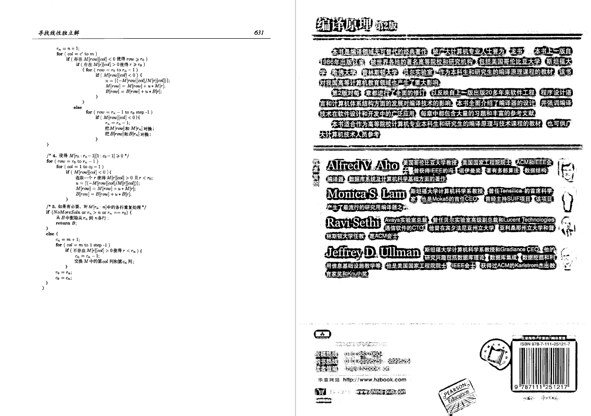

# PDF Image Binarization

> Special thanks to [@chriswolfvision](https://github.com/chriswolfvision) for his [binarization project](https://github.com/chriswolfvision/local_adaptive_binarization).

Binarize all pages in a scanned PDF file. 

Generally, binarizing an image is to turn the image into black and white. It's useful for images from scanner, which not only make the scanned image more readable but also reduce its size. With the tool, you can convert your PDF files from scanner into black and white in batch.

I downloaded a book from digital resources offered by the school library. But I found the PDF file is from a scanner and characters in it is blurred with the background, making it hard to read. So I write this small script to help me binarize them in batch. Here is the binarization result of the book.

**Before**


**After**


## Preparation

> Only support Linux currently. For those Linux distros not using APT as package manager, operations should be similar.

### Install Some Packages
```
# Install OpenCV
sudo apt update
sudo apt install build-essential
sudo apt install cmake git libgtk2.0-dev pkg-config libavcodec-dev libavformat-dev libswscale-dev
sudo apt install libopencv-dev

# Install pdftoppm 
sudo apt install poppler-utils

# Install img2pdf
sudo apt install img2pdf
```

### Clone & Build
```
git clone http://github.com/yusanshi/pdf_image_binarization --recursive
cd pdf_image_binarization
make
```

This will generate an executable file called `binarization` in current direcotry. Use `./binarization input_image.png output_image.png` to test it!


## Binarize PDF File


Put all PDF files to binarize into input directory.

```
# In pdf_image_binarization
python3 binarize.py
```

 After finishing, converted PDF files will be in output directory, each with the same name.

## Others

Sometimes a scanned PDF file may have few pages very different with others. Take my PDF for example, it's covers are scanned in color mode while inside pages in greyscale mode. Also more importantly the background of the covers is black while inside pages white. So the covers of my output PDF are binarized terribly. Compare the last two pages!



If this also happens to you, use your favorite PDF editor (I use Adobe Acrobat DC) to replace these badly-binarized pages with its original.